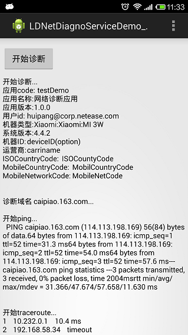

# LDNetDiagnoService_Android
===============

>
* 利用ping和traceroute的原理，对指定域名（通常为后台API的提供域名）进行网络诊断，并收集诊断日志。功能通过Service的方式提供给各个产品项目，由各个项目组决定如何使用。

* Android的实现方案一: 
> 是通过后台线程执行ping命令的方式模拟traceroute的过程，缺点就是模拟过程较慢，timeout的出现比较频繁

 
* Android的实现方案二: 
>通过编译开源网络检测库[iputils](http://www.linuxfoundation.org/collaborate/workgroups/networking/iputils)C代码的方式对traceroute进行了套接字发送ICMP报文模拟，可以明显提高检测速度；（关于iputils工具原理实现，请参考[博文](http://blog.csdn.net/fsdev/article/category/1212445)）

## LDNetDiagnoService最终效果
-------------------
>
* 调用网络诊断服务，监控日志输出；
* 诊断结束之后，返回日志文本;
* 调用者可以选择保存、邮件上传、接口上传等方式上传监控日志；

>如下图所示：

## 如何集成LDNetDiagnoService_Android
-------------------

### 通过库依赖的方式

>
* 拷贝[LDNetDiagnoService_Android](LDNetDiagnoService_Android)文件夹到你的代码空间；
* 在你的主工程中Add LDNetDiagnoService_Android 库工程；

## 如何使用LDNetDiagnoService_IOS
---------------------------------

> 当service代码集成到工程之后，即可通过如下方式调用网络诊断服务：

1. Android的service作为一个后台任务，每次开始诊断需要重新初始化一个任务；通过在监控界面设置LDNetDiagnoListener接口的方法监控日志输出；

	* tip：初始化参数只需要初始化appcode，userID, dormain（必须）, 其他参数选填；
		

			public class MainActivity extends Activity implements OnClickListener, LDNetDiagnoListener{
				...
				
				public void onClick(View v) {
					if(v == btn) {
						if(!isRunning){
							showInfo = "";
							_netDiagnoService = new LDNetDiagnoService("testDemo", 
							"网络诊断应用", "1.0.0", "huipang@corp.netease.com",
							 "deviceID(option)", "caipiao.163.com","carriname", 
							 "ISOCountyCode", "MobilCountryCode", "MobileNetCode", 
							 this);
							 
							 //开始执行网络诊断
							_netDiagnoService.execute();
							progress.setVisibility(View.VISIBLE);
							text.setText("Traceroute with max 30 hops...");
							btn.setText("停止诊断");
						} else {
							progress.setVisibility(View.GONE);
							btn.setText("开始诊断");

							//停止执行网络诊断，取消后台异步任务
							_netDiagnoService.cancel(true);
							_netDiagnoService = null;
						}	
			
						isRunning = !isRunning;
					}
				}
				...
			}	

2. 重载LDNetDiagnoListener方法，监控网络诊断日志；

	* 监控网络诊断过程中的日志输出
	
			@Override
			public void OnNetDiagnoUpdated(String log) {
				showInfo += log;
				text.setText(showInfo);
			}

	* 诊断结束，输出全部日志记录

			@Override
			public void OnNetDiagnoFinished(String log) {
				progress.setVisibility(View.GONE);
				btn.setText("开始诊断");
				_netDiagnoService = null;
				isRunning = false;
			} 

3. 关于service选择traceroute 方式的说明：默认是支持JNICTrace，如果需要通过ping命令行方式执行，可以通过_netDiagnoService.setIfUseJNICTrace(false)设置;

		...
			
		_netDiagnoService = new LDNetDiagnoService();
		
		//设置是否使用JNIC 完成traceroute
		this._netDiagnoService.setIfUseJNICTrace(false);
		
		...

## 技术支持
-------------------

>
to be continued ....

庞辉, 电商技术中心，popo：__huipang@corp.netease.com__
